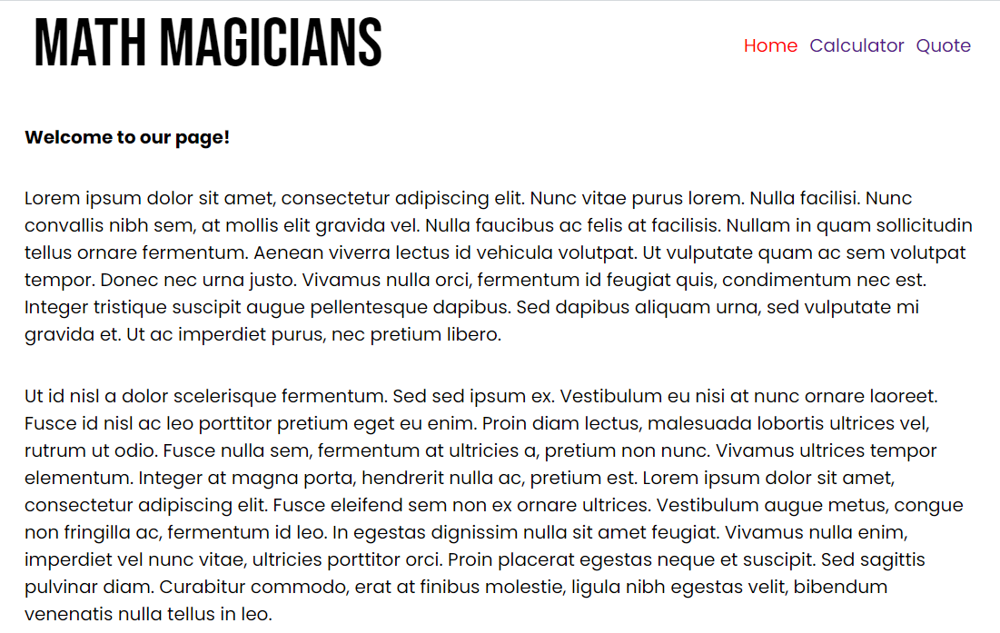
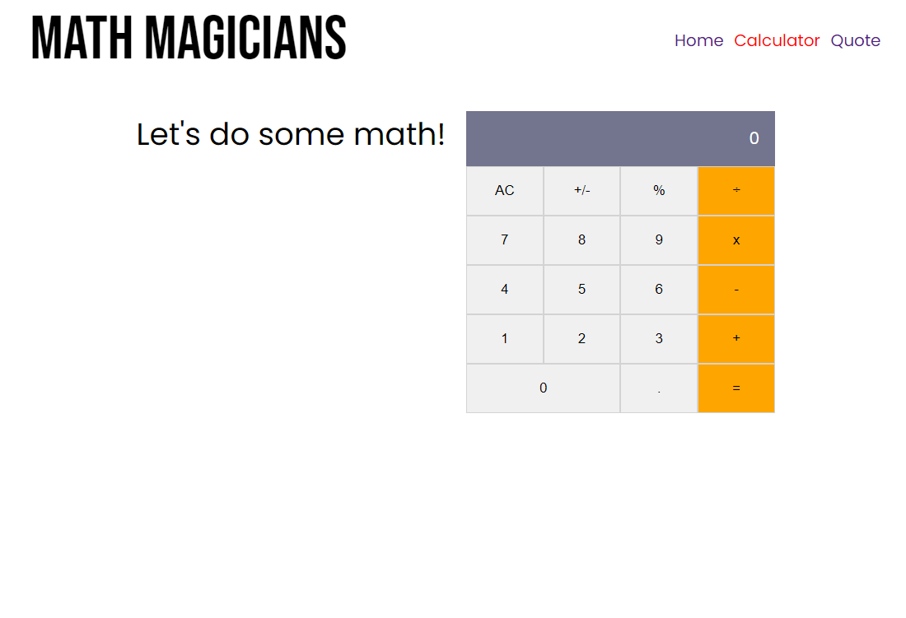
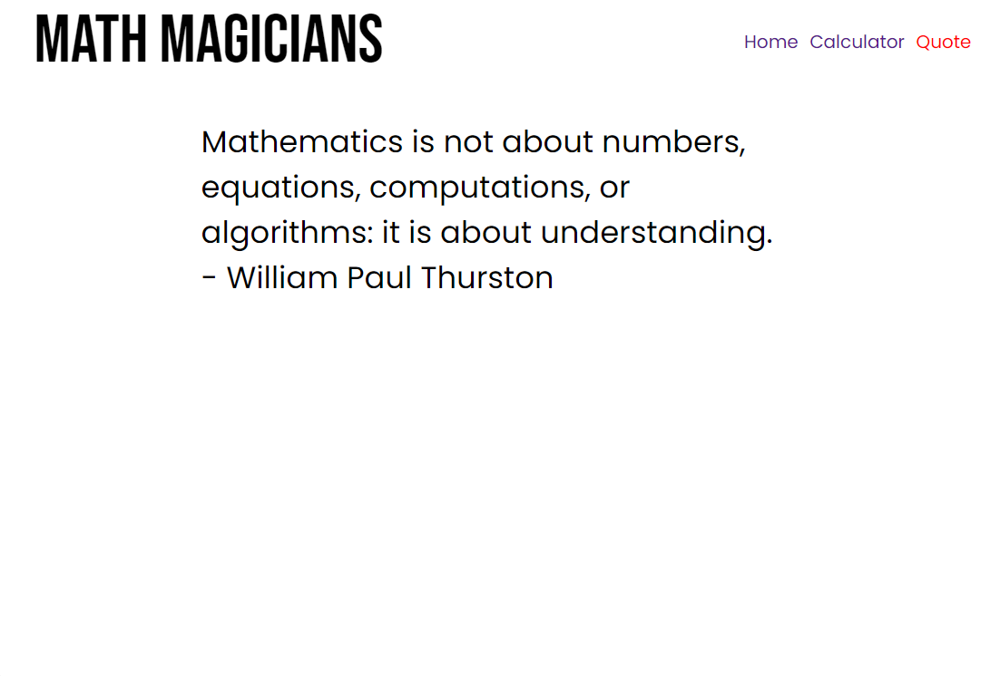

# Math-Magicians
"Math magicians" is a website for all fans of mathematics. It is a Single Page App (SPA) build with React a JavaScript Library. It allows users to: Make simple calculations and read a random math-related quote.

### Preview

## Live Version

Check a live version of the app in the following links:

[Netlify Deploy](https://math-magicinas.netlify.app/)

[Heroku Deploy](https://math-magicinas.herokuapp.com/)

## Built With

- React
- Webpack
- Babel

## Getting Started
- Follow setup instructions below

### Prerequisites

- node.js
- Javascript
- Git and Github
- Terminal
- browser

### Setup

- clone the following repo `git@github.com:orozCoding/math-magicians.git`
- cd into the directory and run npm install to install dependencies
- run npm start

### Usage
- Run npm install on a Terminal to install the modules
- run npm start
- Open http://localhost:3000 to view it in the browser.

## Author

👤 **Angel Orozco** (orozCoding).

- GitHub: [@orozCoding](https://github.com/orozCoding)
- Twitter: [@orozCoding](https://twitter.com/orozCoding)
- LinkedIn: [Angel Orozco](https://www.linkedin.com/in/angel-orozco-652230228/)